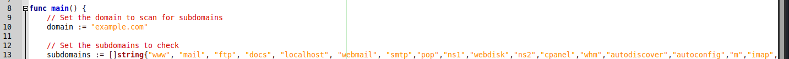
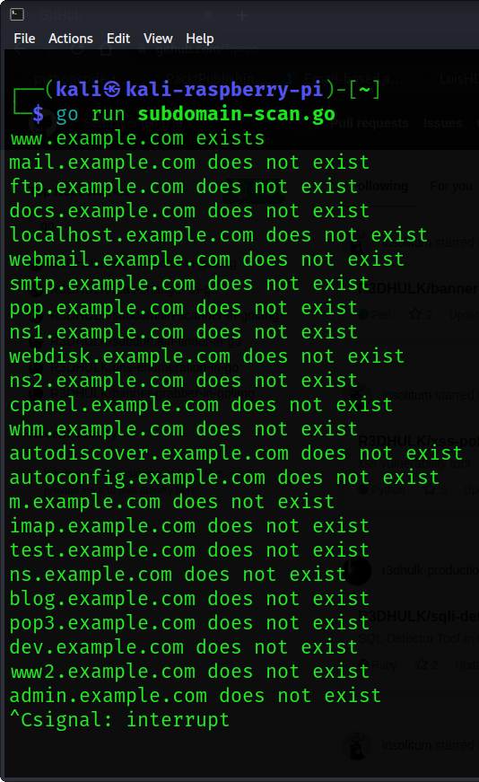

<h1><b>Subdomain Scanner In Go</b></h1>
<h1><b>What Is Subdomain Scanner?</b></h1>
<h2><i>The Subdomain Scanner is a subdomain discovery tool. It allows you to run a scan for a top-level domain name to discover target organization subdomains configured in its hierarchy.</h1></i>

#
 </a>

#
<h2><b> 😇 Author: Sumalya Chatterjee </b></h2>

#
<h1><b>❤️ Don't Copy, Do Fork 😊</b></h1>

#
<h1><b>Open The Go File And Modified Your Domain Name (You Can Also Modified Extra Strings If You Want) 👇</b></h1>



#

<h1><b>And Then Run The Tool 👇</b></h1>


#

<h1><b>Git Installation </h1></b>

```
# Install Git
sudo apt install git

# Install Go
sudo apt install golang

# Git Clone
git clone https://github.com/R3DHULK/subdomain-scanner-in-golang

# Change Directory
cd subdomain-scanner-in-golang

# Open This go file and modified domain name as showed in the first picture
# In My Case I Used example.com for testing purposes

# Run This Tool To Scan Subdomains On Target Networks
go run subdomain-scan.go

```
#
<h2><b><i> Show Support 👇👇👇</b></i> </h2>
<a href="https://www.buymeacoffee.com/r3dhulk"> </a><br><br>

